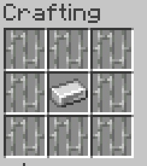

# Crafting a Mob Cage

Before you can capture and transport mobs using RS-MobCages, you must first craft an empty Mob Cage.

The empty Mob Cage is used to capture supported mobs and can be reused after the captured mob has been released.

---

## Crafting Recipe

Place the required ingredients in a crafting table using the following recipe:



The recipe will produce an empty Mob Cage.

---

## Using the Mob Cage

Once crafted, the empty Mob Cage can be used to capture a supported mob.

To capture a mob:

1. Hold the empty Mob Cage in your main hand.
2. Right-click a supported mob.
3. The mob will be captured inside the cage.

The filled Mob Cage can then be carried in your inventory and transported to another location.

For detailed instructions, see:

➡️ [Capturing Mobs](./docs/Capturing-Mobs.md)

---

## Reusing the Cage

Mob Cages are reusable.

After releasing a captured mob, the cage becomes empty again and can be used to capture another supported mob.

This means you do not need to craft a new cage every time you want to move a mob.

```Note:  There is a known issue where sometimes cages will not stack when emptied. We are working to isolate and fix the issue, however, since it is not a breaking issue, it is lower on the priority list.```

For more information, see:

➡️ [Releasing Mobs](./docs/Releasing-Mobs.md)
